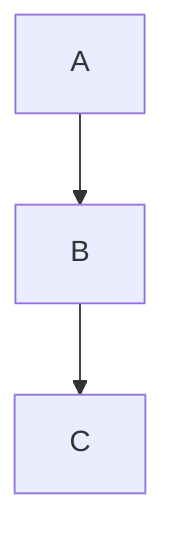

# 写作速查 / Writing Guide

本文是写博客文章时的快速参考。详细的环境搭建与发布流程见 [OPERATIONS.md](./OPERATIONS.md)。

**从 Notion 同步：** 若在 Notion 数据库写作，见 [NOTION_SYNC.md](./NOTION_SYNC.md)（无需 MCP，使用 Notion API）。

---

## 1. 创建新文章

在 `_posts/` 目录下新建文件，文件名格式：

```
YYYY-MM-DD-slug-in-english.md
```

### 最小 Front Matter

```yaml
---
layout: post
title: '文章标题'
subtitle: '副标题（可选）'
date: 2026-01-01 12:00:00 +0900
categories: tech          # 单个分类字符串
author: Wang Tongyu
cover: 'https://images.unsplash.com/photo-xxxx?w=1600&q=900'
cover_author: 'Author Name'
cover_author_link: 'https://unsplash.com/@xxx'
tags:
  - tag1
  - tag2
pin: false                # 是否置顶
---
```

### 可选字段

| 字段 | 说明 | 示例 |
|------|------|------|
| `lang` | 文章语言，不填默认 `zh-Hans` | `en` |
| `mathjax` | 开启 MathJax 数学公式 | `true` |
| `mermaid` | 开启 Mermaid 流程图 | `true` |
| `pin` | 文章置顶 | `true` |

---

## 2. 英文文章

将文件名保持 `YYYY-MM-DD-slug.md`，并在 front matter 中加入：

```yaml
lang: en
```

无需将文件放到子目录。

---

## 3. 封面图

推荐使用 [Unsplash](https://unsplash.com)，复制图片链接并追加 `?w=1600&q=900`：

```
https://images.unsplash.com/photo-XXXX?w=1600&q=900
```

填写 `cover_author` 和 `cover_author_link` 以满足 Unsplash 署名要求。

---

## 4. Markdown 特性

### 代码块

````markdown
```python
print("Hello")
```
````

支持 PrismJS 的所有语言高亮，代码块自动提供复制按钮。

### 数学公式（需 `mathjax: true`）

行内公式：`$E=mc^2$`

块级公式：
```
$$
\int_{-\infty}^{\infty} e^{-x^2} dx = \sqrt{\pi}
$$
```

### 提示框

```markdown
> **NOTE** 这是一条提示
```

### 流程图（需 `mermaid: true`）

````markdown

````

---

## 5. 本地预览

```powershell
# 启动 Jekyll（自动刷新）
bundle exec jekyll serve --livereload
```

打开 http://localhost:4000 预览。

---

## 6. 归档与草稿

- **草稿**：放入 `_drafts/`，本地用 `--drafts` 参数预览，不会发布到线上。
- **归档**：已归档的旧文章也放在 `_drafts/`，保留历史记录。

---

## 7. Front Matter 中的 categories 说明

本站目前使用的分类：

| 分类 | 用途 |
|------|------|
| `Experience` | 经历、面试、工具使用 |
| `Thought` | 随笔、思考 |
| `Curricular` | 课程笔记 |
| `research` | 学术、论文相关 |
| `tech` | 技术笔记 |
